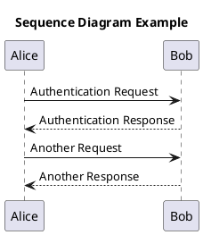
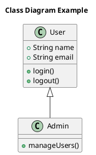
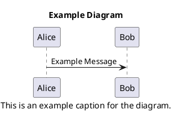
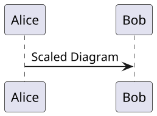
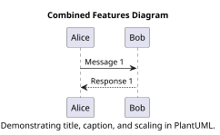

# Chapter 4: PlantUML Diagrams

## 4.1 Introduction to PlantUML

PlantUML is a powerful tool that allows the creation of UML diagrams from plain text descriptions. It supports various diagram types, including sequence diagrams, class diagrams, and more. Integrating PlantUML into your documentation enhances clarity and provides visual representations of complex systems.

---

## 4.2 Basic Syntax and Diagram Types

PlantUML uses a simple and intuitive syntax to generate diagrams. Below are examples of common diagram types.

### 4.2.1 Sequence Diagram

A sequence diagram illustrates how objects interact in a particular sequence of time.

Caption: This sequence diagram shows the interaction between Alice and Bob during an authentication process.

---

### 4.2.2 Class Diagram

## 4.3 Adding Titles and Captions
In PlantUML, you can add titles and captions to your diagrams to provide context and descriptions.

- Title: Use the title keyword to add a title at the top of the diagram.
- Caption: Use the caption keyword to add a caption below the diagram.

## 4.4 Controlling Diagram Size

PlantUML allows you to control the size of your diagrams using the scale command. You can specify the scale as a factor or define exact dimensions.

- Scaling by Factor: scale 1.5 increases the diagram size by 50%.
- Scaling by Width and Height: scale 200 width sets the width to 200 pixels.
- Scaling by Both Dimensions: scale 200*100 sets the width to 200 pixels and height to 100 pixels.

## 4.5 Combining Titles, Captions, and Scaling
You can combine titles, captions, and scaling to create well-formatted diagrams.
